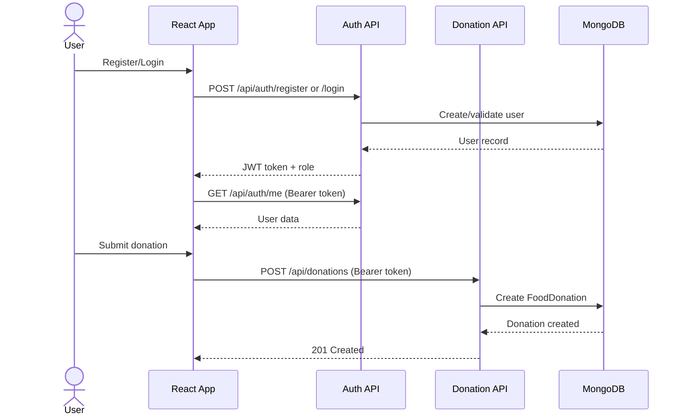

# API Flow Documentation

This document describes the key API flows in the ResQMeals application.

## Authentication and Donation Flow

## Flow Description

### 1. User Registration/Login
- User submits credentials via the React frontend
- Frontend sends POST request to `/api/auth/register` or `/api/auth/login`
- Auth API validates credentials and creates/retrieves user from MongoDB
- Returns JWT token and user role to frontend

### 2. User Authentication
- Frontend includes JWT token in Authorization header (Bearer token)
- GET request to `/api/auth/me` retrieves current user data
- Auth middleware validates token before processing request

### 3. Donation Submission
- Authenticated user submits donation details
- Frontend sends POST to `/api/donations` with Bearer token
- Donation API creates FoodDonation record in MongoDB
- Returns 201 Created status with donation data

## Security Notes
- All protected endpoints require valid JWT token in Authorization header
- Token format: `Bearer <token>`
- Auth middleware validates token and extracts user information
- Tokens include user ID and role for authorization
